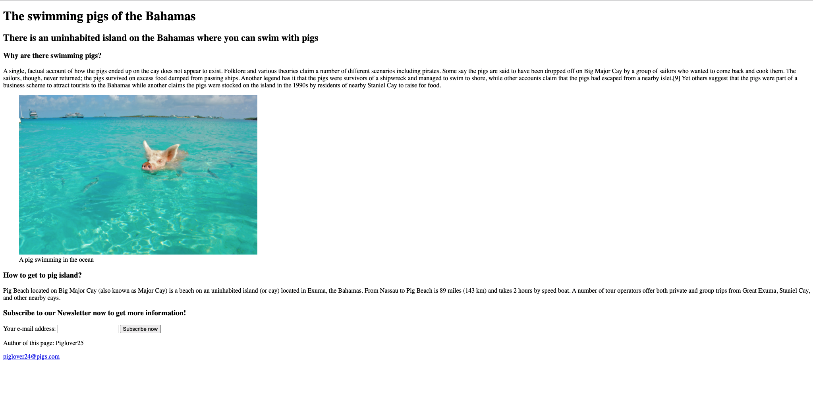

# Assignment: Use semantic and well-structured HTML when possible

In this directory you can find an image `mockup.png` with a mockup of a very simple website about pigs. Additionally you can find all materials needed for the website in the `materials` folder within this directory: the image `swimming-pig.jpg` and all text for the website to copy paste in the text file `text.md`.

## Your turn

Rebuild the website mockup in the `swimming-pigs.html` file using semantic HTML elements whenever possible. Try to use all HTML elements in an accessible way. Also try to structure your HTML well and with a logical order and sectioning, so it's easy to understand and read without additional styling. 

Use only HTML for this assignemnt, no CSS or JavaScript necessary.